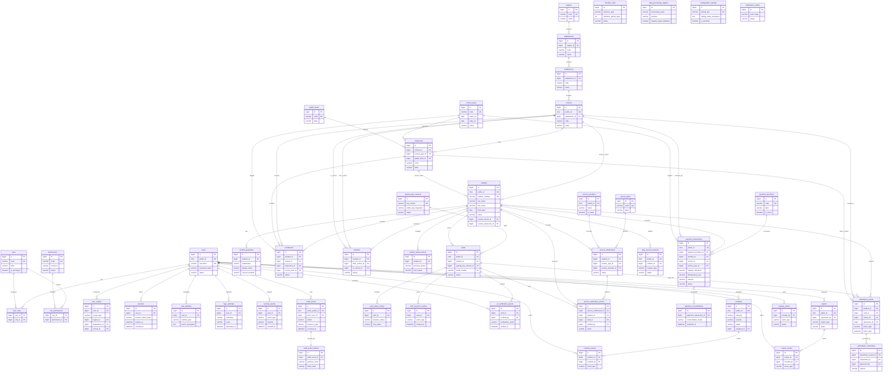

# ER Diagram

Ce diagramme Mermaid represente le modele relationnel logique cible. Il reste volontairement au niveau conceptuel pour la phase 1. Les types SQL precis seront produits en phase 2.

```mermaid
erDiagram
  users {
    bigint id PK
    char public_id UK
    varchar username UK
    varchar password_hash
    varchar status
  }

  roles {
    bigint id PK
    varchar code UK
    varchar label
    boolean is_privileged
  }

  permissions {
    bigint id PK
    varchar code UK
    varchar resource
    varchar action
  }

  user_roles {
    bigint user_id FK
    bigint role_id FK
  }

  role_permissions {
    bigint role_id FK
    bigint permission_id FK
  }

  user_scopes {
    bigint id PK
    bigint user_id FK
    varchar scope_type
    bigint region_id FK
    bigint department_id FK
    bigint school_id FK
  }

  sessions {
    bigint id PK
    bigint user_id FK
    varchar session_token_hash
    datetime expires_at
    datetime revoked_at
  }

  mfa_methods {
    bigint id PK
    bigint user_id FK
    varchar method_type
    text secret_encrypted
  }

  login_attempts {
    bigint id PK
    bigint user_id FK
    varchar username
    varchar result
    datetime attempted_at
  }

  security_events {
    bigint id PK
    bigint user_id FK
    varchar event_type
    varchar severity
    datetime created_at
  }

  audit_events {
    bigint id PK
    char event_public_id UK
    bigint actor_user_id FK
    varchar action
    varchar resource_type
    datetime occurred_at
  }

  audit_event_hashes {
    bigint id PK
    bigint audit_event_id FK
    varchar previous_hash
    varchar event_hash
  }

  regions {
    bigint id PK
    varchar code UK
    varchar name
  }

  departments {
    bigint id PK
    bigint region_id FK
    varchar code
    varchar name
  }

  subdivisions {
    bigint id PK
    bigint department_id FK
    varchar code
    varchar name
  }

  schools {
    bigint id PK
    char public_id UK
    bigint subdivision_id FK
    varchar code
    varchar name
  }

  school_years {
    bigint id PK
    varchar code UK
    date starts_on
    date ends_on
    varchar status
  }

  grade_levels {
    bigint id PK
    varchar code UK
    varchar label
  }

  classrooms {
    bigint id PK
    bigint school_id FK
    bigint school_year_id FK
    bigint grade_level_id FK
    varchar code
    varchar label
  }

  students {
    bigint id PK
    char public_id UK
    varchar student_number UK
    varchar last_name
    varchar first_name
    date birth_date
    varchar status
    bigint current_school_id FK
    bigint current_classroom_id FK
  }

  student_guardians {
    bigint id PK
    bigint student_id FK
    varchar relationship
    varchar display_name
    varchar contact_masked
  }

  enrollments {
    bigint id PK
    bigint student_id FK
    bigint school_id FK
    bigint classroom_id FK
    bigint school_year_id FK
    varchar status
  }

  transfers {
    bigint id PK
    bigint student_id FK
    bigint from_school_id FK
    bigint to_school_id FK
    varchar status
  }

  student_status_history {
    bigint id PK
    bigint student_id FK
    varchar previous_status
    varchar new_status
  }

  signing_key_versions {
    bigint id PK
    varchar key_version UK
    varchar public_key_fingerprint
    varchar status
  }

  cards {
    bigint id PK
    char public_id UK
    bigint student_id FK
    bigint signing_key_version_id FK
    varchar serial_number UK
    varchar status
  }

  card_status_history {
    bigint id PK
    bigint card_id FK
    varchar previous_status
    varchar new_status
  }

  card_issuance_events {
    bigint id PK
    bigint card_id FK
    varchar event_type
    datetime created_at
  }

  qr_verification_events {
    bigint id PK
    bigint card_id FK
    bigint verified_by FK
    varchar verification_result
    datetime verified_at
  }

  attendance_events {
    bigint id PK
    bigint student_id FK
    bigint card_id FK
    bigint school_id FK
    bigint classroom_id FK
    varchar event_type
    datetime event_time
  }

  attendance_corrections {
    bigint id PK
    bigint attendance_event_id FK
    bigint requested_by FK
    bigint approved_by FK
    varchar reason
  }

  service_types {
    bigint id PK
    varchar code UK
    varchar label
  }

  service_providers {
    bigint id PK
    char public_id UK
    varchar name
    boolean is_mock
  }

  service_entitlements {
    bigint id PK
    bigint student_id FK
    bigint service_type_id FK
    bigint service_provider_id FK
    varchar status
  }

  service_verification_events {
    bigint id PK
    bigint service_entitlement_id FK
    bigint student_id FK
    bigint card_id FK
    bigint verified_by FK
    varchar result
  }

  payment_providers {
    bigint id PK
    varchar code UK
    varchar label
    boolean is_mock
  }

  payment_transactions {
    bigint id PK
    char public_id UK
    bigint payment_provider_id FK
    bigint student_id FK
    bigint school_id FK
    bigint school_year_id FK
    varchar opaque_reference
    varchar idempotency_key
    decimal amount
    varchar status
  }

  payment_reconciliations {
    bigint id PK
    bigint payment_transaction_id FK
    varchar reconciliation_status
    datetime matched_at
  }

  incidents {
    bigint id PK
    char public_id UK
    varchar category
    varchar severity
    varchar status
    bigint assigned_to FK
  }

  incident_events {
    bigint id PK
    bigint incident_id FK
    bigint created_by FK
    varchar event_type
  }

  data_access_requests {
    bigint id PK
    char public_id UK
    bigint student_id FK
    varchar request_type
    varchar status
  }

  retention_rules {
    bigint id PK
    varchar resource_type
    int retention_period_days
    varchar status
  }

  data_processing_register {
    bigint id PK
    varchar processing_name
    varchar purpose
    boolean requires_legal_validation
  }

  exports {
    bigint id PK
    char public_id UK
    bigint requested_by FK
    varchar export_type
    varchar status
  }

  export_events {
    bigint id PK
    bigint export_id FK
    bigint created_by FK
    varchar event_type
  }

  configuration_settings {
    bigint id PK
    varchar setting_key UK
    text setting_value_encrypted
    boolean is_sensitive
  }

  notification_events {
    bigint id PK
    varchar event_type
    varchar status
  }

  backup_events {
    bigint id PK
    bigint created_by FK
    varchar event_type
    varchar status
  }

  users ||--o{ user_roles : has
  roles ||--o{ user_roles : assigned
  roles ||--o{ role_permissions : grants
  permissions ||--o{ role_permissions : included
  users ||--o{ user_scopes : limited_by
  users ||--o{ sessions : opens
  users ||--o{ mfa_methods : configures
  users ||--o{ login_attempts : attempts
  users ||--o{ security_events : triggers
  users ||--o{ audit_events : acts
  audit_events ||--|| audit_event_hashes : hashed_by

  regions ||--o{ departments : contains
  departments ||--o{ subdivisions : contains
  subdivisions ||--o{ schools : contains
  schools ||--o{ classrooms : hosts
  school_years ||--o{ classrooms : organizes
  grade_levels ||--o{ classrooms : defines

  schools ||--o{ students : current_school
  classrooms ||--o{ students : current_class
  students ||--o{ student_guardians : has
  students ||--o{ enrollments : enrolled
  schools ||--o{ enrollments : receives
  classrooms ||--o{ enrollments : contains
  school_years ||--o{ enrollments : applies
  students ||--o{ transfers : transfers
  schools ||--o{ transfers : from_school
  schools ||--o{ transfers : to_school
  students ||--o{ student_status_history : changes

  signing_key_versions ||--o{ cards : signs
  students ||--o{ cards : owns
  cards ||--o{ card_status_history : changes
  cards ||--o{ card_issuance_events : emits
  cards ||--o{ qr_verification_events : verified
  users ||--o{ qr_verification_events : performs

  students ||--o{ attendance_events : attends
  cards ||--o{ attendance_events : used_for
  schools ||--o{ attendance_events : located_at
  classrooms ||--o{ attendance_events : class_context
  attendance_events ||--o{ attendance_corrections : corrected_by

  service_types ||--o{ service_entitlements : defines
  service_providers ||--o{ service_entitlements : provides
  students ||--o{ service_entitlements : receives
  service_entitlements ||--o{ service_verification_events : checked
  students ||--o{ service_verification_events : concerns
  cards ||--o{ service_verification_events : uses

  payment_providers ||--o{ payment_transactions : processes
  students ||--o{ payment_transactions : concerns
  schools ||--o{ payment_transactions : received_by
  school_years ||--o{ payment_transactions : applies
  payment_transactions ||--o{ payment_reconciliations : reconciled

  users ||--o{ incidents : assigned
  incidents ||--o{ incident_events : tracks
  users ||--o{ incident_events : writes
  students ||--o{ data_access_requests : subject
  users ||--o{ exports : requests
  exports ||--o{ export_events : tracks
  users ||--o{ export_events : writes
  users ||--o{ backup_events : runs
```

